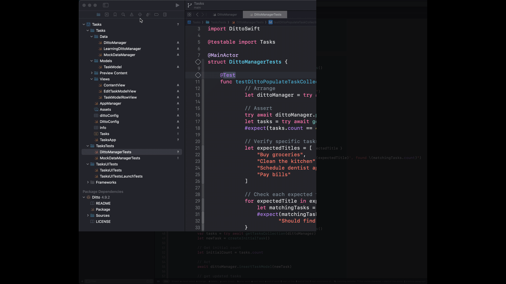
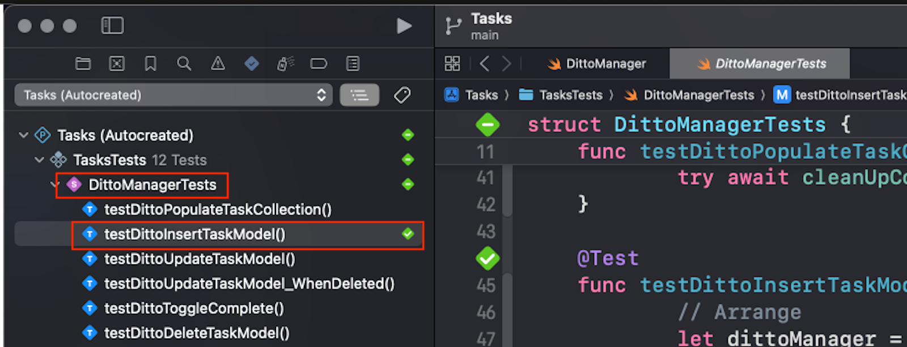

# Welcome to Ditto University! 🚀

> [!NOTE] 
>This is a proof of concept for the Ditto iOS Introduction to Ditto Learning Module.  It is a simple to-do list app that uses Ditto to store and sync the task data.  This is not production ready code and is only meant to be used as a reference for the POC of Ditto University learning modules. 

## Prerequisites

You will need the following to complete this learning module:

- [Xcode](https://developer.apple.com/xcode/) 15 or greater
- Git installed on your machine 
- A Ditto Portal account with an app created (directions provided below)
- Ditto SDK installed as a package dependency using Swift Package Manager (already done for you)


### The Big Peer and Cloud Storage

The `Big Peer` is a trusted cloud deployment of Ditto's sync engine and associated services that enables advanced platform capabilities. Every Ditto Portal account includes a Big Peer instance that serves as a central hub for data storage and synchronization.

In our Tasks app, data is stored in a collection called `tasks` within the Big Peer instance. Each task is stored as a JSON document in this collection. The Ditto SDK provides a unified API for:
- Reading and writing data to the Big Peer
- Synchronizing with other devices (called `Small Peers`) running the same app
- Managing offline data persistence
- Handling real-time updates

This architecture enables seamless data synchronization between:
- Your device and the cloud (Big Peer)
- Your device and other users' devices (Small Peers)
- The cloud and all connected devices

### Ditto Portal Account

To use this project, you'll need a Ditto Portal account so we can sync information to the Big Peer and an application configured in the portal to authenticate our app using the Ditto SDK. Here's how to get started:

1. Create a Ditto Portal account at [portal.ditto.live](https://portal.ditto.live/) if you don't have one already. Follow the [account creation guide](https://docs.ditto.live/cloud/portal/creating-a-ditto-account) for detailed instructions.

2. Create a new application in the Ditto Portal. You'll need the app's ID and online playground token for this project. See the [creating a new app guide](https://docs.ditto.live/cloud/portal/creating-a-new-app) for step-by-step instructions.

These credentials (app ID and online playground token) will be used to authenticate your application with Ditto's services.  

### Package Dependencies

The Ditto SDK is already included in this project as a Swift Package Manager dependency. When creating your own Ditto-enabled applications, adding the SDK as a package dependency is a required first step.

For detailed instructions on adding the Ditto SDK to your own projects, refer to the [Swift SDK installation guide](https://docs.ditto.live/sdk/latest/install-guides/swift#installing-package-dependencies).

### Clone the repository

Clone the repository to your local machine using the following command:

```bash
git clone https://github.com/ditto-examples/learning-swift-introduction
```

---------------

# Introduction to Ditto Learning Module with iOS and SwiftUI

Welcome to the Tasks app learning module! This hands-on project will guide you through integrating Ditto into an existing SwiftUI application, teaching you essential concepts of offline-first data synchronization. You'll experience a common real-world scenario: transforming a prototype into a production-ready application with robust data management capabilities.

## The Scenario

You've just joined a development team for the company Acmezon that recently demonstrated a task management app to company leadership. The app demo was a hit - the UI was polished, the interactions were smooth, and leadership was ready to ship it immediately. There was just one catch: the entire app was running on mock data.

The prototype lacks several critical features modern users expect:
- No offline support - data disappears when the app closes
- No data persistence - changes aren't saved between sessions
- No synchronization - changes don't sync between devices
- No real-time updates - users don't see each other's changes

Rather than rebuilding from scratch, the team has decided to integrate Ditto to add these essential features. Your mission is to transform this prototype into a production-ready application with robust offline-first capabilities and peer-to-peer synchronization, all while maintaining the existing user experience.

## Learning Objectives

Through this module, you'll learn how to:
1. Replace mock data with a real Ditto database
2. Implement offline-first data persistence
3. Enable real-time updates across devices

## Project Structure

The app currently uses a `MockDataManager` for all data operations. Your task will be to implement the `DittoManager` class to replace the mock functionality with real Ditto features. The project includes TODO comments guiding you through each implementation step.

The mock implementation provides a clear reference for how each feature should work, making it easier to understand what needs to be replicated with Ditto.

Let's get started transforming this prototype into a production-ready app!

### The TaskModel Struct

The Tasks app uses a `TaskModel` struct to represent each task in the system. Each task has four properties:

- `_id`: A unique identifier for the task
- `title`: The description of the task
- `done`: A boolean indicating whether the task is completed
- `deleted`: A boolean used for implementing soft deletes

When a task is completed, its `done` property is set to `true`. Instead of permanently removing tasks from the database, the app uses a "soft delete" pattern - setting the `deleted` property to `true` when a task is deleted. This approach preserves the task's data for potential restoration and maintains a complete history of all tasks.

For more information about implementing soft deletes in Ditto, see the [soft delete pattern documentation](https://docs.ditto.live/sdk/latest/crud/delete#soft-delete-pattern).

## Building and Running the iOS Application

To see the app in action running with mock data, let's build and run the app by following these steps:

1. Log into the Ditto portal at <https://portal.ditto.live/>.  Make note of the app ID and online playground token.
2. Launch Xcode and open the `/Tasks/Tasks.xcodeproj` project.
3. Open the `dittoConfig.plist` file and update your app ID and online playground token with the values from the Ditto portal.
4. Navigate to the project **Signing & Capabilities** tab and modify the **Team** and **Bundle Identifier** settings to your Apple developer account credentials to provision building to your device.
5. In Xcode, select a connected iOS device or iOS Simulator as the destination.
6. Choose the **Product > Run** menu item.

The app will build and run on the selected device or emulator.  You can add, edit, and delete tasks in the app.  But if you close the app and open it up, all your changes will be lost due to the mock data.  Let's start fixing that by replacing the mock data with a real Ditto database.

## Implementing Ditto

### Step 1: Setup Ditto Identity 

Open the `DittoManager.swift` file and find the `initialize()` method.  This is the place to setup Ditto Identity.

```swift
        //
        //TODO: setup Ditto Identity
        //
        //UPDATE CODE HERE
```
You can find this quickly by using the quick selection bar in Xcode.


Let's update the `TODO` comment to set up Ditto Identity. A Ditto Identity provides the SDK with your application credentials and connection details. These credentials - your app ID and online playground token - are stored in `dittoConfig.plist` and automatically loaded into the `DittoManager` through the `appManager`.

Since the credentials are already available through the `appManager`, we can use them to create our Ditto Identity. Replace the `TODO` comment with this code:

```swift
ditto = Ditto(
	identity: .onlinePlayground(
		appID: appManager.appConfig.appId,
		token: appManager.appConfig.authToken,
		enableDittoCloudSync: true
	)
)
```

As you can see we are using the identity type of `onlinePlayground`.  This tells the Ditto SDK to connect to the Ditto Cloud and use the app ID and online playground token for authentication.  The enableDittoCloudSync flag tells the SDK to use the Ditto Cloud for sync.

This all seems great, but how can we test this?  Let's update the populateTaskCollection function to use Ditto to populate the initial task the app should include in the task collection.  Then we can use the unit tests to verify that the task collection was populated with the correct data, which proves that the Ditto Identity was setup correctly.

### Step 2: Populate the Task Collection

Find the `populateTaskCollection()` function.  This is the place to populate the task collection with data.

```swift
func populateTaskCollection() async throws {
	
	let initialTasks: [TaskModel] = [
		TaskModel(
			_id: "50191411-4C46-4940-8B72-5F8017A04FA7",
			title: "Buy groceries"),
		TaskModel(
			_id: "6DA283DA-8CFE-4526-A6FA-D385089364E5",
			title: "Clean the kitchen"),
		TaskModel(
			_id: "5303DDF8-0E72-4FEB-9E82-4B007E5797F0",
			title: "Schedule dentist appointment"),
		TaskModel(
			_id: "38411F1B-6B49-4346-90C3-0B16CE97E174",
			title: "Pay bills"),
	]
	
	for task in initialTasks {
		do {
			if let dittoInstance = ditto {
				//
				//TODO: add tasks into the ditto collection using INSERT statment
				// https://docs.ditto.live/sdk/latest/crud/write#inserting-documents
				//
				
				//UPDATE CODE HERE
			}
		} catch {
			appManager.setError(error)
		}
	}
}
```

This function initializes the app with some starter data, making it an ideal place to demonstrate using the Ditto SDK for inserting documents into the task collection. Let's implement the functionality by updating the `TODO` comment.

Ditto uses its own query language called `Ditto Query Language (DQL)` to manipulate data. Similar to SQL, `DQL` provides a familiar syntax for database operations. For a detailed explanation of DQL syntax, see the [document creation guide](https://docs.ditto.live/sdk/latest/crud/create#creating-documents).

The following `DQL` statement can be used to insert a document into the task collection:
```sql
INSERT INTO tasks INITIAL DOCUMENTS (:task)
```
Note this uses a special key word `INITIAL DOCUMENTS` which tells Ditto to insert the documents into the collection only if they don't already exist.  

The `:task` is a `DQL` variable that will be replaced with the actual task data, which we pass in as an argument.  The argument would take in the task object which is represented by the TaskModel struct, which we discussed earlier.

The arguments syntax would look like this:
```swift
"task": 
  [
      "_id": task._id,
      "title": task.title,
      "done": task.done,
      "deleted": task.deleted,
  ]
```

> [!NOTE] 
>It's extremely important that the `:task` variable is used in the DQL statement matches the name of the argument.  If it doesn't match, the DQL statement will not work.

In order to run a DQL statement, we need to use the `store.execute()` method from the `Ditto` instance, passing it a `DQL` query and `arguments`.  Now replace the `TODO` comment with the code to use the `DQL` statement to insert the task into the task collection.

```swift
try await dittoInstance.store.execute(
  query: "INSERT INTO tasks INITIAL DOCUMENTS (:task)",
  arguments: [
    "task":
     [
         "_id": task._id,
         "title": task.title,
         "done": task.done,
         "deleted": task.deleted,
     ]
  ]
)
```

All DQL statements are executed through the `store` property and the execute method of the `Ditto` instance.

With this code now replaced, we can run the unit test to verify that the following was setup correctly:
- The `dittoConfig.plist` was updated with the app ID and online playground token
- The ditto instance was initialized `initialize()` function the with the app ID and online playground token
- The `populateTaskCollection()`  function was updated with the DQL statement to insert the task into the task collection.

To run the unit tests, you can select the Task Navigator tab in Xcode and click the play button next to the `populateTaskCollection()` function listed under the DittManagerTests group.  This will run the unit test and verify that the task collection was populated with the correct data.



You should see a message that the `Test Succeeded!`   Congratulations - virtual high five 🙏! You've done your first major task of replacing the mock data with a real Ditto database.  Let's move on to the next step of adding offline-first data persistence.

### Step 3: Register Observers for the Task Collection 

An observer is a function that is called when any documents in a collection that match a query change.  Store observers are useful when you want to monitor changes from your local Ditto store and react to them immediately. For instance, when your end user updates their profile, asynchronously display changes in realtime.  This feature is useful for implementing real-time updates across devices, like when one user adds a task, the other user sees the task in realtime.

The Ditto Manager provides a `@Published` property `tasks` which is an array of `TaskModel` objects.  Our UI in the app responds to changes in this property to update and draw the list of tasks.  We can use the observer to update the `tasks` property when the data in the task collection changes for any reason, like when a task is added, updated, or deleted from your device or other devices that have the app installed.

Let's implement the observer for the task collection so the app can respond to changes in the task collection.  Find the `registerObservers()` function.  This is the place the app registers observers for the task collection.

```swift
func registerObservers() throws {
        if let dittoInstance = ditto {
            
            //
            //TODO: - setup observer query, filter out NOT deleted
            //
            
            //UPDATE CODE HERE
            
            //
            //TODO: - setup store observer with query and set array with TaskModel
            //
            
            //UPDATE CODE HERE
        }
    }
```

To start out, we need to replace the `TODO: - setup observer query, filter out NOT deleted` and `//UPDATE CODE HERE` comments with a query.  This query will select all documents from the `tasks` collection where the `deleted` property is `false`.

```swift
let observerQuery = "SELECT * FROM tasks WHERE NOT deleted"
```

Replace the comments and `//UPDATE CODE HERE` comment with this query.  

Now we need to setup the store observer with the query.  We can register an observer with the store.registerObserver function.  This function takes in a query, a callback, and an optional context.  The callback will be called when any documents that match the query change.  The callback will be passed the results of running the query.  We can use this call back function to update the `tasks` property.  Find the ` //TODO: - setup store observer with query and set array with TaskModel` comments and replace the `//UPDATE CODE HERE` comment with the following code to register the observer. 

```swift
 storeObserver = try dittoInstance.store.registerObserver(query: observerQuery)
  { [weak self] results in
    Task { @MainActor in
    // Create new TaskModel instances and update the published property
     self?.tasks = results.items.compactMap{
       TaskModel($0.jsonString())
     }
   }
  }
```
> [!NOTE] 
> We store a reference to the observer in the `storeObserver` property.  This allows us to cancel the observer, which can be useful in several situations, like document eviction.  We can cancel the observer with the `storeObserver.cancel()` function.  More information about observers can be found in the [Reacting to Data Changes](https://docs.ditto.live/sdk/latest/crud/observing-data-changes) section of the documentation.

With this code now replaced, let's move on to the next step of setting up Ditto Sync before we can test the code in the app.

### Step 4: Setup Ditto Sync

Ditto's synchronization model is designed for real-time, offline-first, and peer-to-peer (P2P) data propagation. Unlike traditional client-server architectures where clients must connect to a centralized database, Ditto enables direct communication between devices, ensuring that data stays available and up-to-date even when offline. Data synchronization works the same whether the device is synchronizing with other devices in the mesh, or with the Big Peer. Simply by subscribing to new data, Ditto ensures that data flows from elsewhere in the mesh to the subscribing device.

To setup sync with Ditto, we need to do two things:

1. Setup a subscription to what data we want to sync 
2. Start the Sync process 

Let's start with the first step.  We need to setup a subscription to the task collection.  This will tell Ditto what data we want to sync and from which devices.  Find the comments `//TODO: implement the startSync` in the  `startSync()` function .  

```swift
   private func startSync() throws {
        do {
            if let dittoInstance = ditto {
                //
                //TODO: implement the startSync
                // https://docs.ditto.live/sdk/latest/install-guides/swift#integrating-and-initializing-sync
                //
                
                //UPDATE CODE HERE
                
                //
                //TODO: implement the set subscription
                // https://docs.ditto.live/sdk/latest/sync/syncing-data#creating-subscriptions
                //
                
                //UPDATE CODE HERE
            }
        } catch {
            appManager.setError(error)
            throw error
        }
    }
```
To start out, we need to replace the first instance of `//UPDATE CODE HERE` comments with the code to start the sync process.  This is done by calling the `startSync()` function from the `Ditto` instance.  Update the `//UPDATE CODE HERE` comment with the following code:

```swift
try await dittoInstance.startSync()
```

Now we need to replace the second instance of `//UPDATE CODE HERE` comments with the code to set the subscription.  This is done by calling the `sync.registerSubscription()` function from the `Ditto` instance.  The `registerSubscription()` function takes in a `DQL` query of what information you want to sync.  As explained earlier, we want to sync all documents from the `tasks` collection where the `deleted` property is `false`.  Update the `//UPDATE CODE HERE` comment with the following code:

```swift
let subscriptionQuery = "SELECT * from tasks"
subscription = try dittoInstance.sync.registerSubscription(query: subscriptionQuery)
```

> [!NOTE] 
> We store a reference to the subscription in the `subscription` property.  This allows us to cancel the subscription, which can be useful in several situations, like document eviction.  We can cancel the observer with the `subscription.cancel()` function.  More information about subscriptions can be found in the [Managing Subscriptions](https://docs.ditto.live/sdk/latest/sync/syncing-data) section of the documentation.

With this code now replaced, we can update the app to use the Ditto Manager instead of the MockDataManager.  Let's do that now.  This will allow us to test the app with the real Ditto database and see the data that we created in Step 2 where we populated the task collection.

### Step 5: Replace the MockDataManager with DittoManager

To replace the MockDataManager with the DittoManager, we need to update three files in our application:
- TasksApp.swift
- ContentView.swift
- EditTaskModelView.swift

Since both DittoManager and MockDataManager conform to the DataManager protocol, we can simply replace the class names. This works because any function using the DataManager protocol will work with either manager implementation.

#### TasksApp.swift

First, open `TasksApp.swift` and update the App to use `DittoManager`. Find the first `//TODO: update to DittoManager` comment and replace it with:

```swift
@StateObject private var dataManager: DittoManager = {
```

Then, update the second instance of the `//TODO: update to DittoManager` comment with:
```swift
let manager = DittoManager(appManager: AppManager(configuration: loadAppConfig()))
```

#### ContentView.swift

In `ContentView.swift`, we need to update three instances of `MockDataManager`:
1. The `@EnvironmentObject` property in ContentView
2. Two references in the ViewModel class

You can use Xcode's Find and Replace feature to change all instances of `MockDataManager` to `DittoManager`.

#### EditTaskModelView.swift

Similarly in `EditTaskModelView.swift`, update:
1. The `@EnvironmentObject` property
2. References in the ViewModel class

Use Find and Replace to change `MockDataManager` to `DittoManager`.

With these updates complete, you can now run the app to see the data we created in Step 2. Congratulations! 🎉 You've successfully replaced mock data with a real Ditto database.

While this is a significant achievement, there's still work to do. The `+ New Task` button will crash the app (💀) because we haven't implemented the DittoManager functions for adding or updating tasks. Let's address that next.

### Step 6: Update the insertTaskModel function 

The DittoManager uses the `insertTaskModel` function to add a new task to the task collection.  This function is called when the user taps the `+ New Task` button in the app.  The function calls the TaskModel's value property to get the task data as a dictionary and stores that dictionary in a variable called `newTask`.  

```swift
let newTask = task.value
```

We need to update this function with a DQL statement to insert a new task into the task collection and then an execute call that will run the DQL statement and use the newTask dictionary as the argument.  Find the `// TODO - write INSERT DQL Statement` comment in the `DittoManager` class.  you will see the following code:

```swift
 let query = ""
```
Update the query string in the code using the DQL `INSERT INTO` statement, which is in the format of:

```sql
INSERT INTO <collection> DOCUMENTS (:<argument_name>)
```

The collection name is `tasks` and the argument_name is the `newTask` dictionary.  This statement should look very similar to the DQL statement we used in Step 2 in the `populateTaskCollection` function to insert the initial tasks into the task collection.  

> [!NOTE]
>If you need a refresher, review the [document creation guide](https://docs.ditto.live/sdk/latest/crud/create#creating-documents) and the [DQL Insert](https://docs.ditto.live/dql/insert) documentation.  If you look at the documentation, the code example for the query they use is inserting into a `cars` collection, where you want to insert into the `tasks` collection.  The argument they use in the documents is `:newCar` where you will be using one called `:newTask`. 


With the query string updated, we need to update the execute call to run the DQL statement.  Find the `//TODO: use dittoInstance store to execute DQL with arguments` comment that should be right below the query string you just updated.  You will see the following code:

```swift
if let dittoInstance = ditto {
  //
  //TODO: use dittoInstance store to execute DQL with arguments
  // https://docs.ditto.live/sdk/latest/crud/create#creating-documents
  //
                
  //UPDATE CODE HERE
}
```

We need to update the code to use the `dittoInstance.store.execute()` method to execute the DQL statement.  The execute function takes in two arguments:
- query:
- arguments: 

```swift
await ditto.store.execute(
  query: <query_variable> 
  arguments: ["<argument_name>": <dictionary>]);
```

Update the code, passing in the `query` variable as the query, update the argument_name with the `:newTask` and pass in the `newTask` dictionary as arguments.  The syntax should look very similar to the code we used in Step 2 in the `populateTaskCollection` function to insert the initial tasks into the task collection.  

Once this is completed, you can run the integration test `testDittoInsertTaskModel` in Xcode Test Navigator to validate that your code works. 



With the integration test passing, we can move on to the next step of updating the `updateTaskModel` function.

### Step 7: Update the updateTaskModel function 

The DittoManager uses the `updateTaskModel` function to update an existing task.  This function is called when the user taps on any tasks in the list of tasks in the app and then uses the form to update information about the task.   

In Ditto, we use the `DQL Update` statement to update data in the database.  The DQL Update statement is in the format of:

```swift
let query = "UPDATE <your_collection_name> SET <field1> = <:placeholder1>, <field2> -> <:placeholder2>, ... WHERE [condition]"
```

When using a seperate string for the query, you can use the `:placeholder` syntax to pass in the value in the arguments dictionary.  The [Ditto documentation](https://docs.ditto.live/sdk/latest/crud/update#updating) provides an example using the `cars` collection.  An updated version of the documentation's car example is provided below:

```swift
let query = "UPDATE cars SET color = :color WHERE _id = :id"

try await ditto.store.execute(
  query: query,
  arguments: ["color": "blue", "id": "123"]
);
```

With this new information, we can update the `updateTaskModel` function in the DittoManager class.  Locate the updateTaskModel function in the DittoManager class by looking for the `//TODO: write UPDATE DQL Statement` comment.  First, replace the `let query = ""` with the DQL Update statement.  The query should look very similar to the cars example above with the following changes:

- Replace the `cars` collection with the `tasks` collection
- Replace the `color` field with the `title` field
- Add a field for the `done` property
- Add a field for the `deleted` property

With the query string updated, we need to update the execute call to run the DQL statement.  Find the `//TODO: use dittoInstance store to execute DQL with arguments comment that should be right below the query string you just updated.  You will see the following code:

```swift
if let dittoInstance = ditto {
  //
  //TODO: use dittoInstance store to execute DQL with arguments
  // https://docs.ditto.live/sdk/latest/crud/update#updating
  //
               
  //UPDATE CODE HERE
}
```

Update the code to use the `dittoInstance.store.execute()` method to execute the DQL statement.  The execute function takes in two arguments:
- query:
- arguments: 

The query variable is the query string you just updated.  The arguments is a dictionary with the keys you created in the DQL Update statement:
- title
- done
- deleted
- _id

The values for the keys are the values from the `task` object passed into the function, using the same property names.  Once this is completed, you can run the integration test `testDittoUpdateTaskModel` in Xcode Test Navigator to validate that your code works.  With the integration test passing, we can move on to the next step of updating the `toggleComplete` function.

### Step 8: Update the toggleComplete function 

The `toggleComplete` function is called when the user taps the checkbox in the task cell.  This function toggles the `done` property of the task.  Like in the previoius step, we use the `DQL Update` statement to update data in the database.  

Locate the `//TODO: write toggle UPDATE DQL Statement` comment in the DittoManager class.  First, replace the `let query = """` with the DQL Update statement.  This query should be the same as the previous step, except the only field we will update is the done field, so you can copy the previous query and remove the title and deleted fields. 

Next locate the `//TODO: use dittoInstance store to execute DQL with arguments` comment that should be right below the query string you just updated.  You will see the following code:

```swift
if let dittoInstance = ditto {
  //
  //TODO: use dittoInstance store to execute DQL with arguments
  // https://docs.ditto.live/sdk/latest/crud/update#updating
  //
                
  // UPDATE CODE HERE
}
```

Update the code to use the `dittoInstance.store.execute()` method to execute the DQL statement.  The execution statement be the same as the previous step, except the only field we will update is the done field, so you can copy the previous query and remove the title and deleted fields from the arguments passed into the execute function.  Once completed, you can run the integration test `testDittoToggleComplete` in Xcode Test Navigator to validate that your code works.  

With the integration test passing, we can move on to the final step of updating the `deleteTaskModel` function.

### Step 9: Update the deleteTaskModel function 

There are several options for removing a document from Ditto.  A full list of options can be found in the [Ditto documentation](https://docs.ditto.live/sdk/latest/crud/delete).  This app uses the [Soft-Delete](https://docs.ditto.live/sdk/latest/crud/delete#soft-delete-pattern) pattern to delete a task.  A soft-delete pattern is a way to flag data as inactive while retaining it for various requirements, such as archival evidence, reference integrity, prevention of potential data loss due to end-user error, and so on.  The `TaskModel` object has a `deleted` property that is used to flag the task as deleted, and we use our subscription query to filter out tasks where the deleted property is `true`.

The `deleteTaskModel` function is called when the user swipes to delete a task. This function uses the `DQL Update` statement to update the `deleted` field of the task to `true`.  Locate the `//TODO: write UPDATE DQL Statement using Soft-Delete pattern` comment in the DittoManager class in the deleteTaskModel function.  First, replace the `let query = ""` with the DQL Update statement.  This query should be similar as the previous step, except the only field we will update is the deleted field which we can hard code to be set to `true`, so you can copy the previous query and switch the done field to the deleted field, setting it's value to `true` right in the DQL Update statement.  Note you don't need to use the `:placeholder` syntax because we are not using a placeholder for the deleted field.

Next, locate the `//TODO: use dittoInstance store to execute DQL with arguments` comment that should be right below the query string you just updated.  You will see the following code:

```swift
if let dittoInstance = ditto {
  //
  //TODO: use dittoInstance store to execute DQL with arguments
  // https://docs.ditto.live/sdk/latest/crud/update#updating
  //
                
  //UPDATE CODE HERE
}
```
Update the code to use the `dittoInstance.store.execute()` method to execute the DQL statement.  The execution statement be the same as the previous step, except the only argument we are passing is is the `_id` field since we hard coded the deleted property to `true` in our `DQL statement`.  Once completed, you can run the integration test `testDittoDeleteTaskModel` in Xcode Test Navigator to validate that your code works.  

## Run the App

You can now run the app and test the new ditto functionality.  You can add, update, and delete tasks from your device and other devices that have the app installed.  You can also see the changes in realtime as they are made.

## Conclusion

Congratulations - you have completed the Tasks app learning module! 🎉 You've now replaced the mock data with a real Ditto database and implemented offline-first data persistence.  You can now add, update, and delete tasks from your device and other devices that have the app installed.  You can also see the changes in realtime as they are made.
