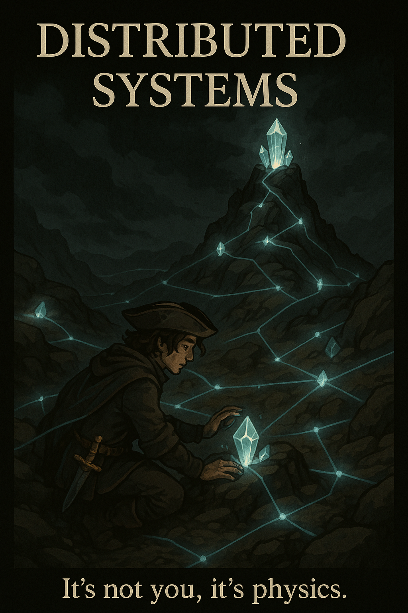
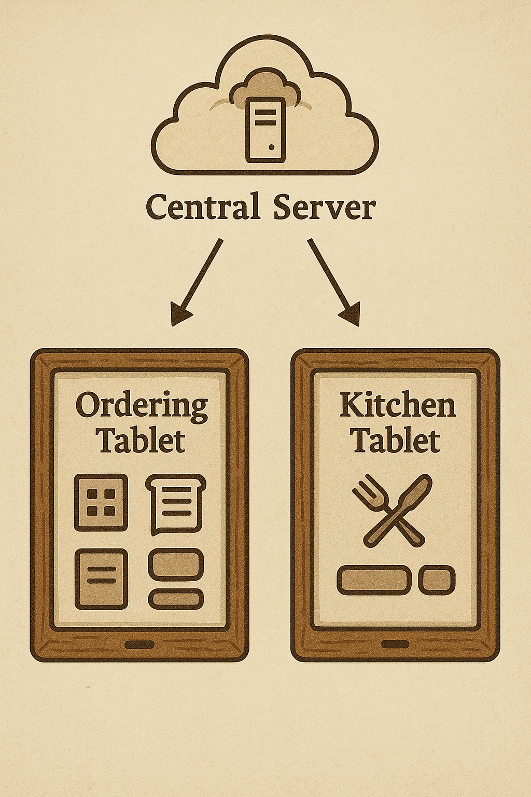
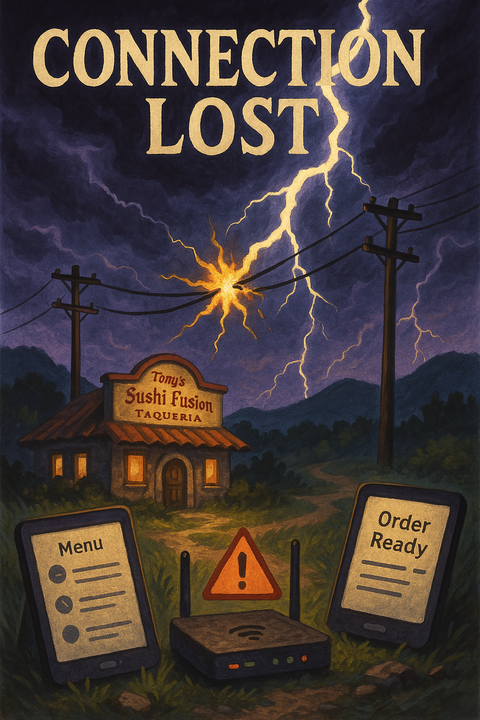
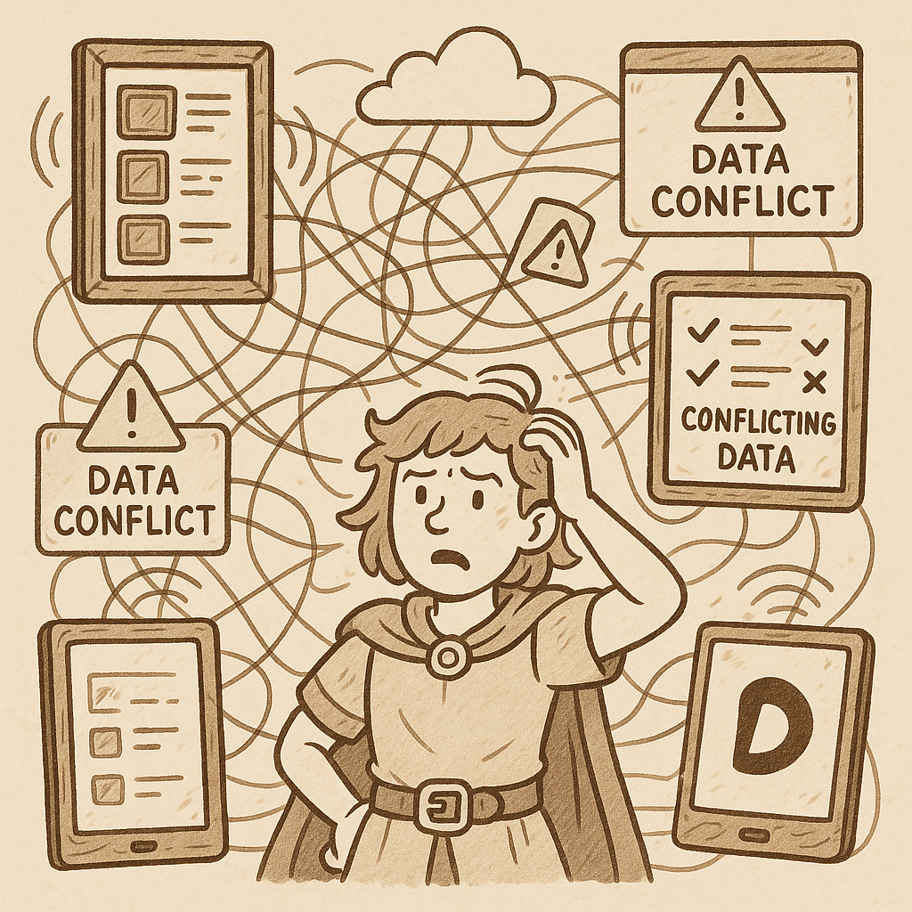
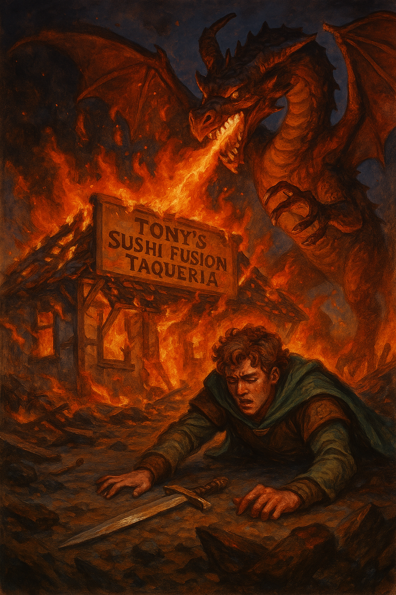
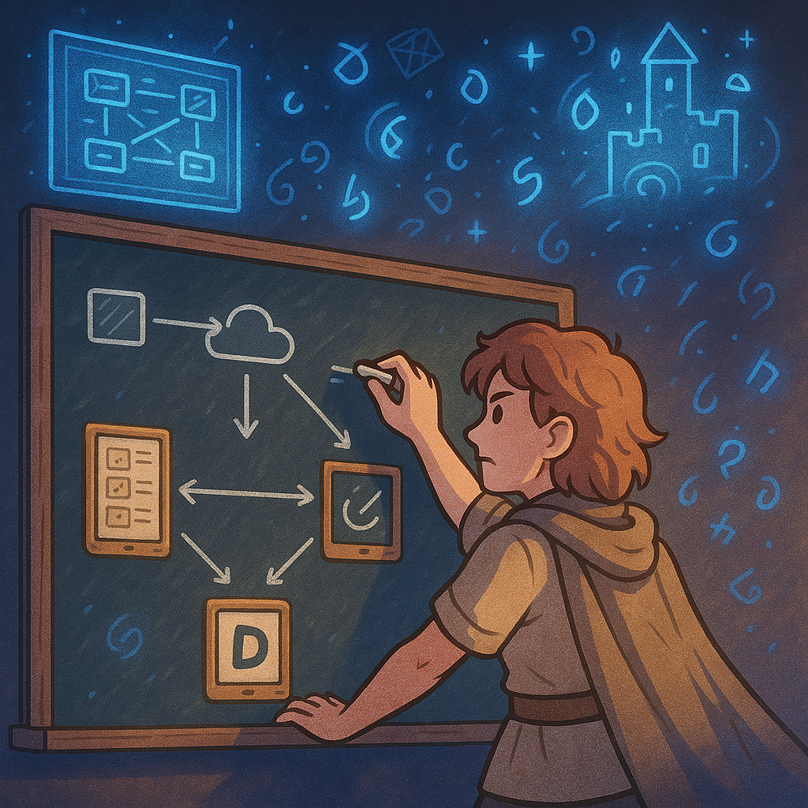
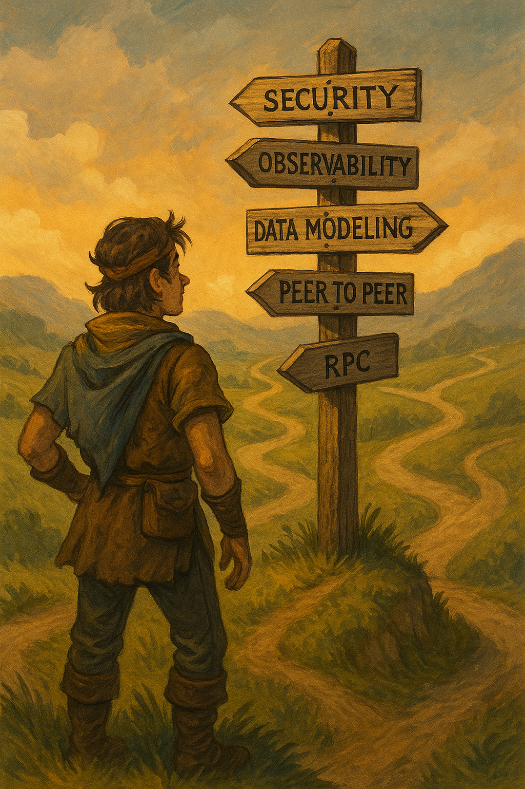

# Article: Introduction to Distributed Systems with Ditto

Welcome, friend. I imagine you are a developer, or working closely with some who are writing software.

You may have built applications, frontends, maybe web services, or maybe you work across the entire stack. It’s highly likely you have worked with APIs and client/server or RPC architectures. 

At its core, the flow I am talking of is of “computer wants data and computer gets it from another computer”. Happens every time you want to build anything useful, right?

Now, given you are reading this, I assume you are exploring Ditto. It's a piece of technology that automagically syncs data between devices - via its database. Building this from scratch, as you surely imagine, takes a lot. 
You need to understand:
- databases, 
- transports to connect between the two devices,
- reconciling changes between databases, 
- handling conflicts between devices, 
- multihopping across the mesh network, 
- communication with cloud services and databases, 

... and these are just the core features. Wouldn't it be great if there was a tool that took care of all these challenges, without needing you to reinvent the wheel? Enter Ditto. Ditto handles that, and more, to help you build resilient, _radically distributed_ systems that work across any platform. The hard part is done for you, easy peasy.

However, there’s a catch. You are still building a radically distributed system, and radically distributed systems play by radically different rules than “traditional” RPC architectures. (It’s not me, it’s physics).

In this article, you will learn about some examples of where the challenges lie and how to overcome them through a quick, and hopefully fun, thought exercise. 
Let me take you on a quest.

## The Quest for a Mythical Sushi Taco

You are Tony, an up-and-coming restauranteur in your village, and you have a dream.

Your dream is to open a restaurant, but not just any restaurant. Oh no, we are talking about **Tony’s Sushi Fusion Taqueria**, a one-of-a-kind place to fulfill your dreams (and belly) with only the finest of transpacific fusion fare. You are hungry, and ready to hustle to hit it big.

You have done all the boring bits. Bought the land, built a restaurant, hired staff, and all you need to do now is to build a kitchen ordering system, so your customers can place orders for their free range artisanal Sushi Tacos and your kitchen can make them and let them know when they are ready. It’s an IT system, you know this. Let’s sketch it out. 

### Designing Tony’s Sushi Fusion Taqueria’s IT System

What are the components of such a restaurant IT system?

- Client devices - take a tablet for ordering, and a tablet for the kitchen for order fulfillment
- Admin web interface - where you update menus, add specials, …
- A cloud server - to route all this between them, and operate the database of orders

Between these components, what else do we need - a few API endpoints

- An API, hosted at `https://tsft.com/api` and admin endpoint at `https://tsft.com/admin`
- A few API endpoints:
    - create orders - `POST /orders` (used by cashier)
    - fetch orders - `GET /orders/open` and `GET /orders/completed` (used by kitchen and cashier)
    - set order as completed or modify it - `PUT /orders/{id}`
    - fetch menu items - `GET /menu` (used by cashier)

The IT infrastructure seems robust with the new 10GB fiber optic link and a powerful router. What could possibly go wrong?

You are rightfully proud of how quickly you are able to get this whole thing up and running. Your restaurant is open for business AND raking in profits! Hooray!

### Alas, Disaster Strikes

Just as you’re settling into the rhythm of your successful operation, nature has other plans... A storm has passed through your village overnight, and besides overturning a few bins behind the shop, it has also severed your precious 10GB fiber optic link! Your server is down, and the restaurant cannot make any orders!

Centralized systems, while convenient, have a glaring weakness: a single point of failure. If the server or the network goes down, your entire operation grinds to a halt.

This highlights the inherent vulnerability of centralized architectures: a single point of failure can cripple the entire system.

Time to invest in resiliency, then.

You discover **Ditto**, a syncable database that promises your devices connectivity with or without internet. It creates a kind of mesh network that runs a copy of the database on every device, no central server required. THAT would solve all your infrastructure and connectivity problems!

Armed with docs and your wealth of skill building IT systems, this will indubitably be a sushi taco walk, especially since all the difficult bits are already done by this wondrous piece of technology. Conflict resolution, networking, all done for you - ready to plug and play.

### Designing Tony’s Sushi Fusion Taqueria’s Distributed IT System

Looking at the docs, you understand that a distributed system is different from a conventional system. There’s a document database on every device! This means that every device is a little server on its own. You've always wanted to have a pet server, so your eyes water, somewhat.

You sketch out the architecture.

- Every device is a server
- Therefore, every device is also a *client*
- The interaction
    - cashier creates a `post_order` document with order payload addressed at the desired kitchen unit
    - Kitchen unit makes an order and creates a `complete_order` document addressed at the desired cashier unit
    - Cashier and kitchen units subscribe to respective documents addressed to them - `complete_order` and `post_order` - respectively.

Unbeknownst to you, by making each device a standalone server, you’ve created a chaotic mesh of connections that can’t adapt when just one link breaks.

### The distributed dragon of defiance rears its ugly head

As you embark on your journey, things work well for a while, but when you keep adding more devices, scaling to more restaurants, cracks appear to form in your design.

The systems turns out to not be as resilient as you had hoped. As more devices join the network, the once smooth operation begins to falter. You notice that managing direct connections between every device is becoming a tangled mess, both conceptually and in practice. It turns out that each device acting as a server is more of a burden than a solution. The router breaks, you cannot address the cashiers correctly anymore as their addresses have changed. You have to manually re-point them to the new addresses. Same happens when a particular device goes offline or needs to be replaced. You have also introduced bugs in the software that are difficult to test for. Fix one, and more appear. Things start to slow down as more devices are introduced. When you rearrange the layout of the store to accommodate more customers, you unknowingly introduce dark spots in connectivity. 

It turns out your mesh isn't a mesh, but really just a slow conflated mess, and the only thing you managed to successfully distribute is the ways it could go wrong!

The hero is defeated, everything is seemingly lost.

### Redesigning for Distributed Systems

You get knocked down, but you get back up again, and return to the drawing board. You need to become master of distributed system design.

You analyze each of the mistakes in your architecture, and correct them.

- Instead of writing whole order documents constantly, you transmit deltas - of what has changed. Instead of sending entire orders over and over, you only send the small changes – the deltas – which drastically reduces network load and speeds up the system. Let the sync engine figure out the rest. Even low bandwidth transports like Bluetooth are now resilient, and fast.
- Instead of directly "addressing" your orders to specific devices, you treat them as "interests", and spread them out throughout the mesh. An available kitchen display will handle an active order, and mark it accordingly for others.
- Your newly formed mesh network lets you fill and avoid any dark spots in your wifi network, letting your waiters move around the restaurant effectively.
- Focusing on testability and observability you manage to iron out the bugs, and your customers do not complain anymore.

The formidable distributed dragon of defiance is defeated, and Tony’s Sushi Fusion Taqueria is now the most successful restaurant chain in the world, on every street corner, all thanks to your mastery of distributed systems.

## Lessons Learned and Conclusions  
This journey through Tony’s Sushi Fusion Taqueria has hopefully given you a taste of the challenges and opportunities that come with building distributed systems. It’s not just about fixing bugs or optimizing performance—it’s about rethinking how your system should operate in the face of constant change and connectivity disruptions.  
  
Were you able to spot the challenges with the original distributed implementation?  
Did you agree with the technical decisions we stated originally?  
  
There are of course many more challenges we haven’t covered that you need to consider when building a resilient distributed system. Here are just a few of them:
- Observability: How do you effectively monitor and understand the system in production?
- Testability: How do you make sure your system is testable despite its complexity?
- Seam Isolation: What’s the best way to interact with your external systems while keeping seam logic isolated?
- Data Model Consistency: How can you ensure models are comparable, even if not identical?
- Mesh Scalability: What practical implications arise as your mesh network grows?
- Data Cleanup: How do you ensure that old or unwanted data is removed from all devices in the network?
- Conflict Resolution: What strategies can be employed to avoid or mitigate conflicts between devices?  

## Next Steps  
Your journey doesn’t end here! You’ve gained valuable insights into distributed system design, but there’s so much more to explore. We’ve only scratched the surface, and your next step is to deepen your understanding of how Ditto can help you build truly resilient, flexible systems.  
  
Follow along with the material we have ready for you in the upcoming chapters of Ditto University. Whether you are building Device-to-Cloud, Peer-to-Peer, offline-only, or hybrid topologies, we have topics covering architecture, data modeling, security, observability, and much more.  
  
There’s a world of distributed systems knowledge waiting for you—let’s continue the journey together!

