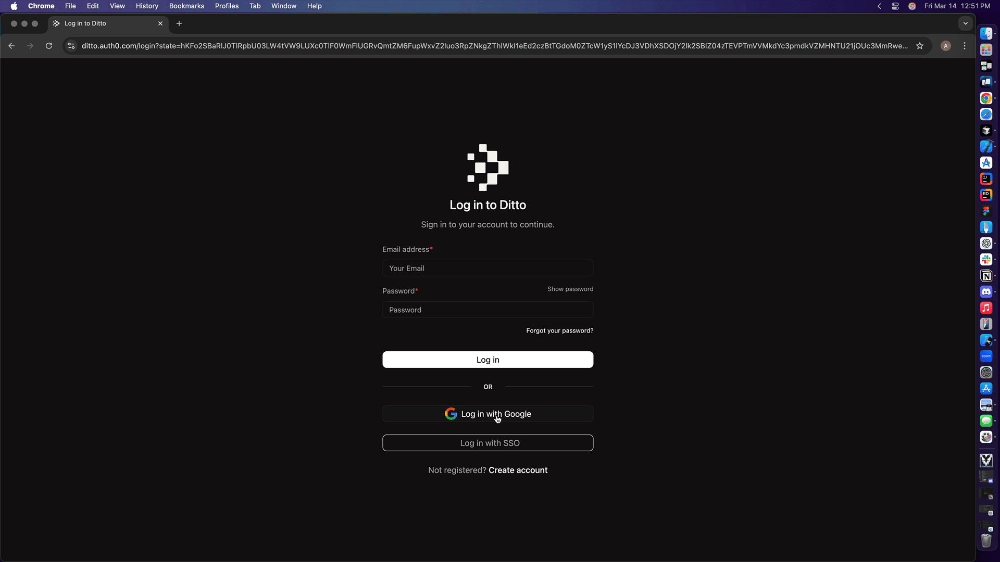
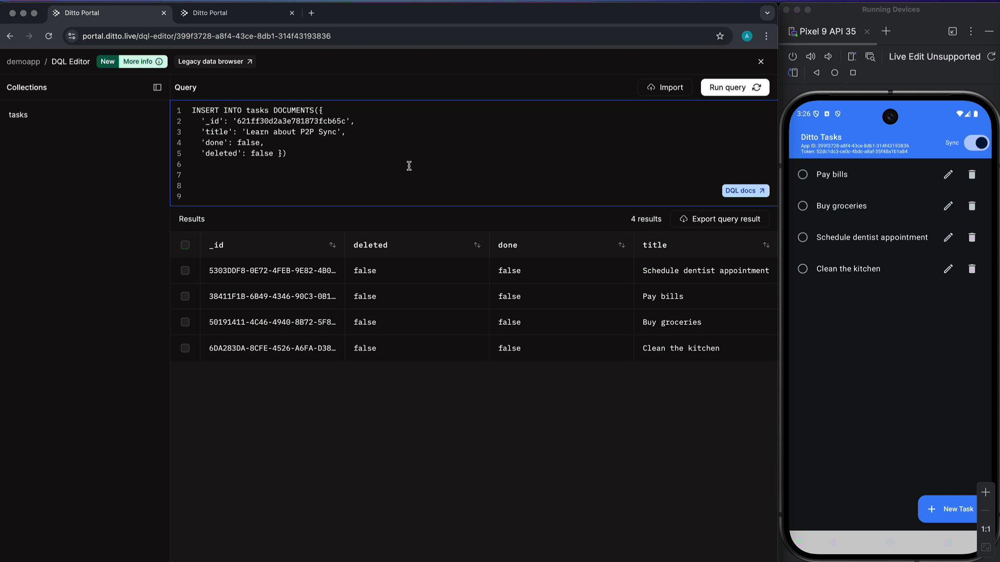
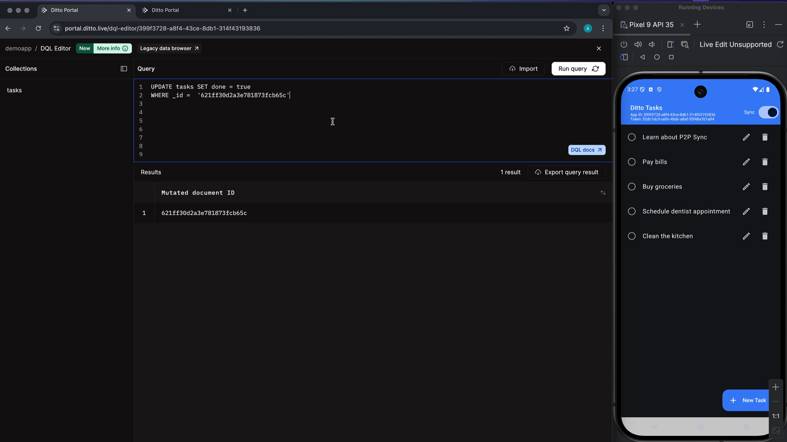

# Lab 2: Validate Sync Process - Android JetPack Compose with Kotlin Application

In the previous lab, we updated the code to start the sync process and create a subscription query.  In this lab, we will validate that the sync process is working by using the Ditto Portal Query Editor.  To start, we need to open the Ditto Portal and navigate to the Data Browser and Editor. 

## Tasks: Open Portal and Navigate to Editor  
- Open the [Ditto Portal](https://portal.ditto.live/).  
- Once logged in, select your app from the list of apps.  
- Select the Collecitons tab.
- Click on the `DQL Editor` button

This should open the DQL Editor with a list of collections in your app.  If the previous lab was completed successfully, you should see the `tasks` collection in the list and the query editor should be pre-populated with a select all query showing the four tasks that are displayed in the app. 



We can now use the query editor to update information in the `task` collection and validate that the changes are synced to the mobile app.  

## Task: Insert a new Task in the Query Editor 

- In the query editor, remove the current `SELECT` statement
- Add the following INSERT statement in to insert a new task into the `tasks` collection:
```sql
INSERT INTO tasks DOCUMENTS({
  '_id': '621ff30d2a3e781873fcb65c',
  'title': 'Learn about P2P Sync',
  'done': false,
  'deleted': false })
```
- Click the `Run query` button to execute the query.
- Once the query runs, it should return the new document ID that was created in the `tasks` collection.
- Bring up your mobile app and verify that the new task is displayed in the list of tasks.



## Task:  Update a Task from the Query Editor

- In the query editor, remove the current `INSERT` statement
- Add the following UPDATE statement in to UPDATE the existing task: 
```sql
UPDATE tasks SET done = true
WHERE _id =  '621ff30d2a3e781873fcb65c'
```
- Click the `Run query` button to execute the query.
- Once the query runs, it should return the document ID that was updated in the `tasks` collection.
- Bring up your mobile app and verify that the task was marked as done in the list of tasks.



## Task: Add a new Task from the mobile app 

- Add a new task in the mobile app.   
- Run a select query to verify that the task was added to the `tasks` collection.
```sql
SELECT * FROM tasks 
```
- Click the `Run query` button to execute the query.
- Verify that the task was added to the `tasks` collection.


Feel free to play around with adding and updating tasks from the mobile app or the portal and then validate the changes are synced to the Ditto Cloud.  

🎉 You have finished validating that the sync process is working between the mobile app and the the `BigPeer`!

[Return to the lesson](../README.md) to continue.